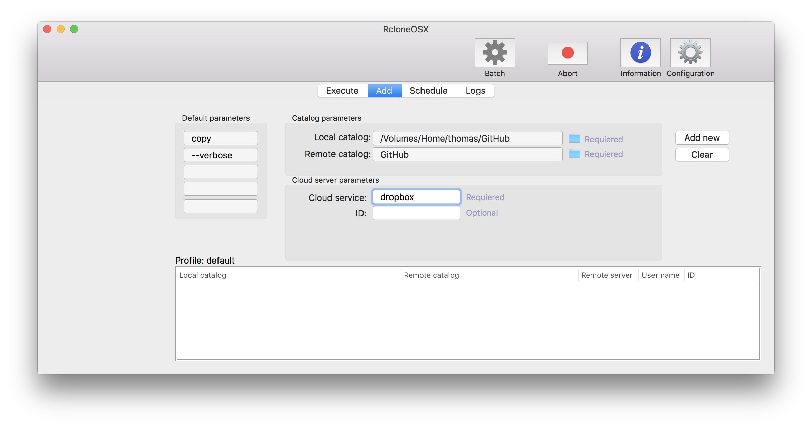
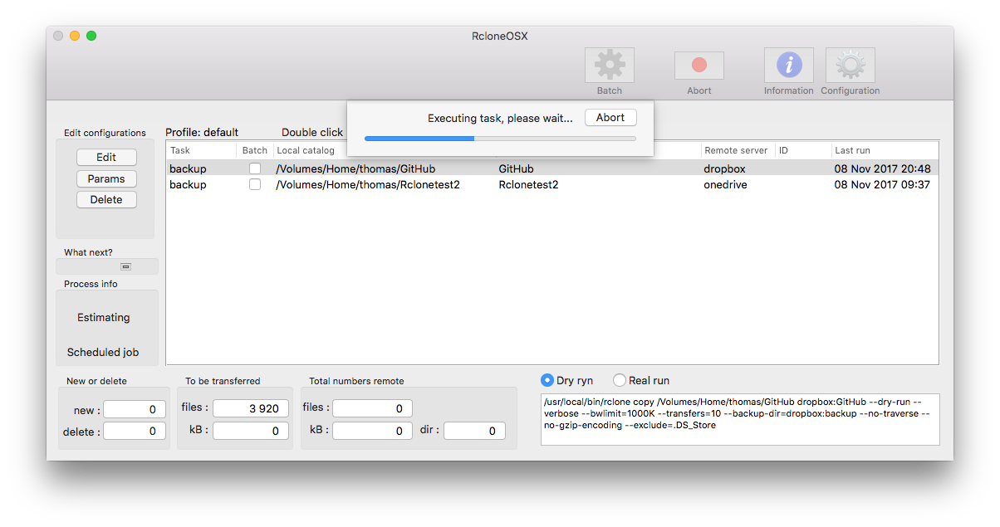
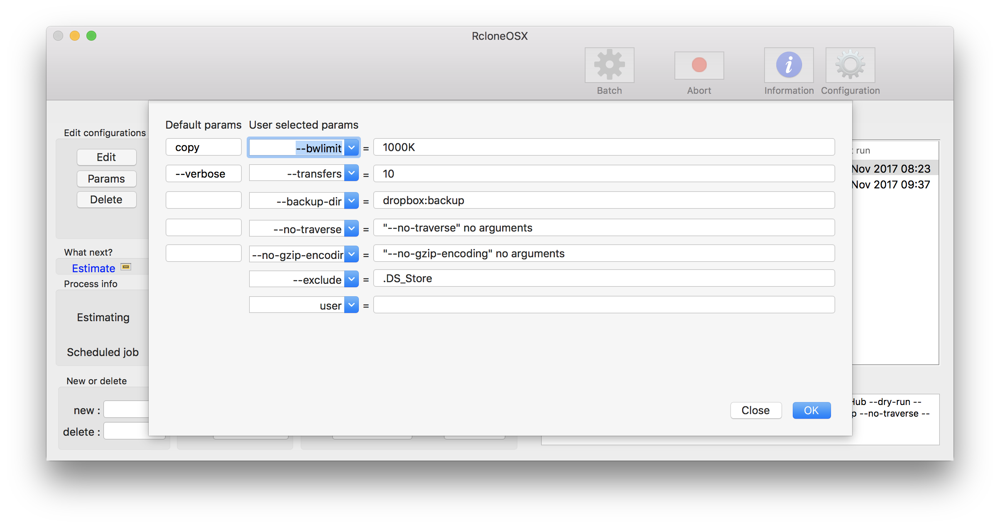
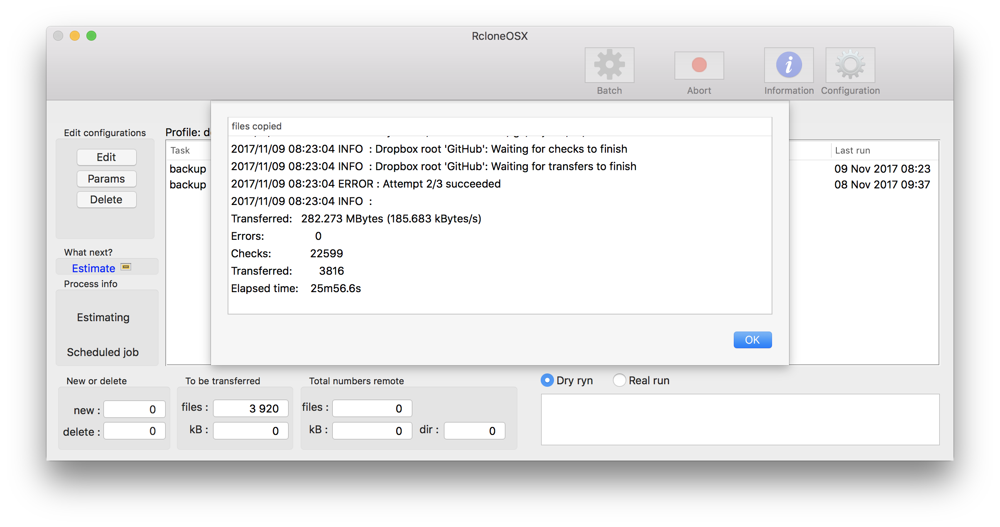

## RcloneOSX

The project is a port of RsyncOSX to adapt [rclone](https://rclone.org/). It compiles, it executes and it does a `rclone copy`, `sync` and `move` command but there is still much work to do.

RcloneOSX is compiled with support for macOS version 10.11 - 10.13. The application is implemented in **Swift 4** by using **Xcode 9**.

RcloneOSX **require** the rclone utility to be installed. If installed in other directory than `/usr/local/bin`, please change directory by `Configuration`. RcloneOSX checks if there is a `rclone` installed in the provided directory.

RcloneOSX is built upon the code for RsyncOSX. Please see the [intro](https://rsyncosx.github.io/Documentation/docs/Intro.html) part of RsyncOSX to get an idea of how RcloneOSX is working.

#### SwiftLint

As part of this version of RcloneOSX I am using [SwiftLint](https://github.com/realm/SwiftLint) as tool for writing more readable code.

### Application icon

The application icon is created by [Forrest Walter](http://www.forrestwalter.com/). All rights reserved to Forrest Walter.

### Changelog

Please see [Changelog](https://rsyncosx.github.io/Documentation/docs/RcloneOSX/Changelog.html)

### Sample transferring data to Dropbox

Below are some screenshots for transferring (`rclone copy`) my local GitHub repository to Dropbox. The actual command executed is shown in right corner.

