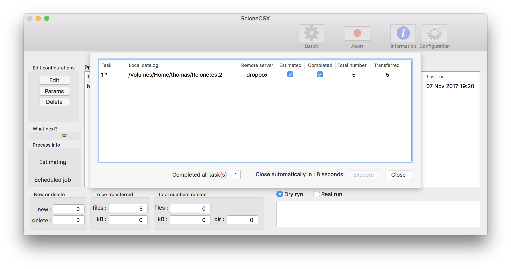
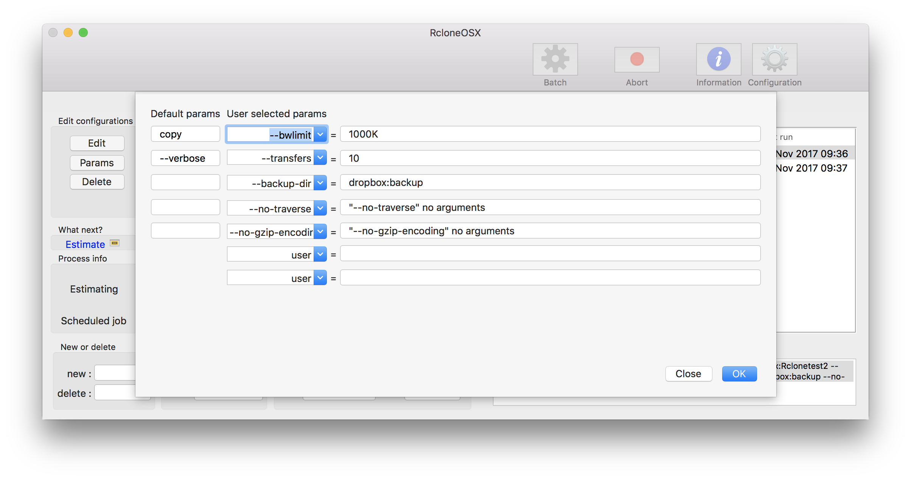
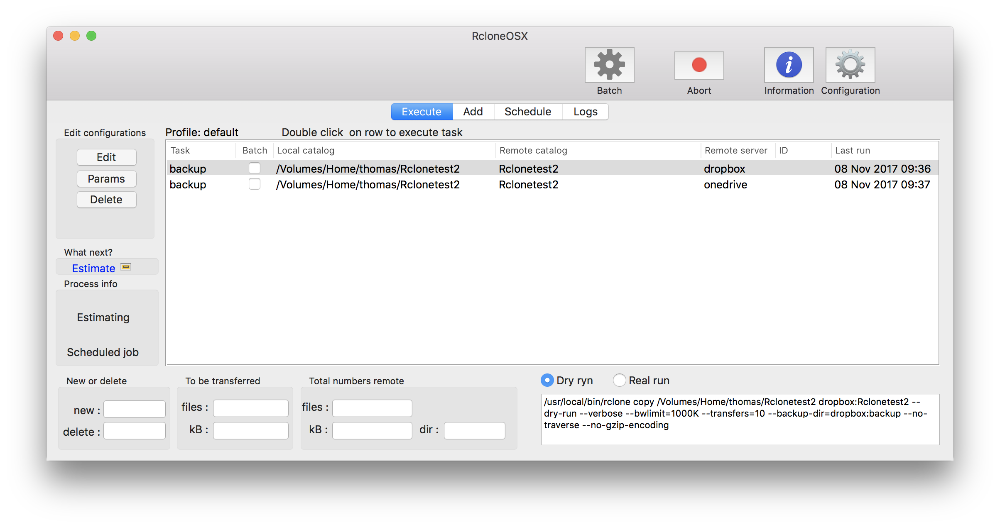
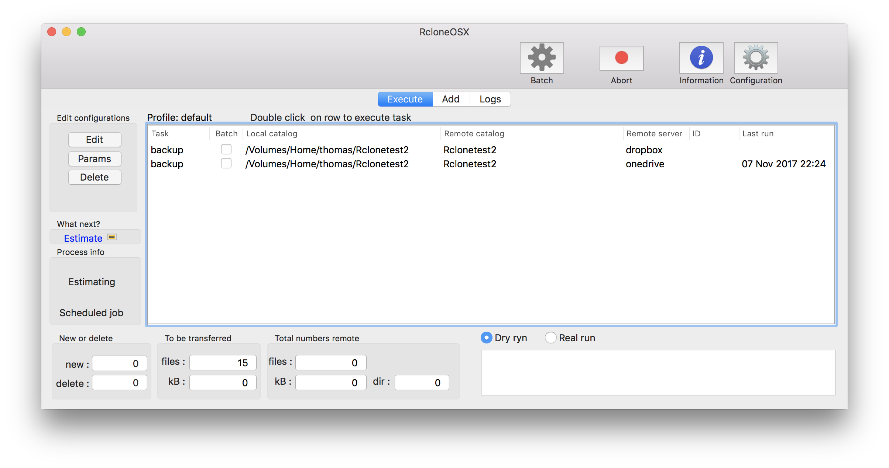
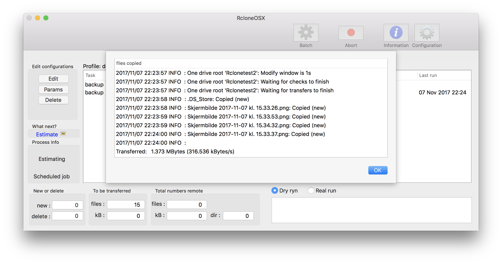
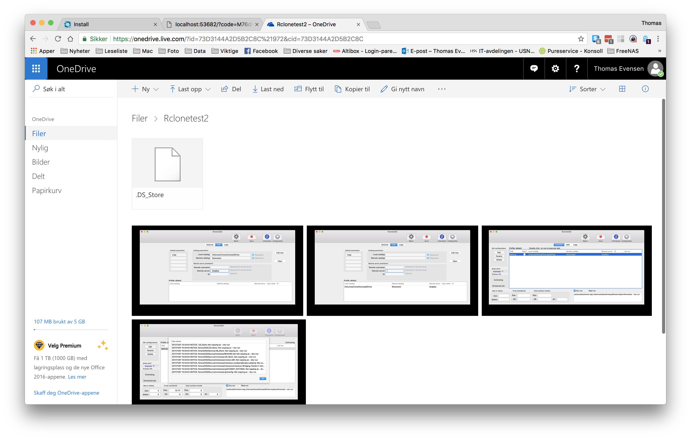

# Changelog

I have commenced a new project adapting RsyncOSX to RcloneOSX. RcloneOSX is, when it is released in version 1.0.0, utilizing the [rclone](https://rclone.org) command line tool for backup/copy files to various number of cloud storage services as Dropbox.

## Version 0.0.1

By a couple of hours work with RcloneOSX I managed to do a `rclone copy` of a local directory to remote directory at Dropbox and Microsoft Onedrive. The Numbers part does not work yet because the output from `rclone` is quite different compared to `rsync`. Below are some screenshots from testing.

Adding cloud services is done by using the command line interface `rclone config`.

### What is working

* only `rclone copy`
  - verified with Dropbox and Microsoft Onedrive, expect others to work as well
* adding and executing single tasks
* batch tasks
* scheduled tasks
* logging tasks (only date, no numbers)
* profile, storing tasks in profiles
* change and delete configurations
* some parameters are working (just a few tests)

### What is not working

* numbers and statistics of transferred data
* for the moment only `rclone copy`
  - my knowlegde about rclone and its use is growing every day...
* no gui for `rclone config`
  - don't know if is possible to make a GUI for setting up rclone
  - for the moment investigating this issue is put on hold

### Dropbox

Adding a configuration...

Executing a `--dry-run` and executing the real run. Some files are not copied.

The progress bar is working.

Logging the run, the numbers not yet working.

The transferred files at Dropbox.

And batch work is working "out of the box"

#### Parameters to rclone
Some parameters are working...

### Microsoft Onedrive
Adding a configuration...

Execute task...

Files are transferred to Onedrive...

