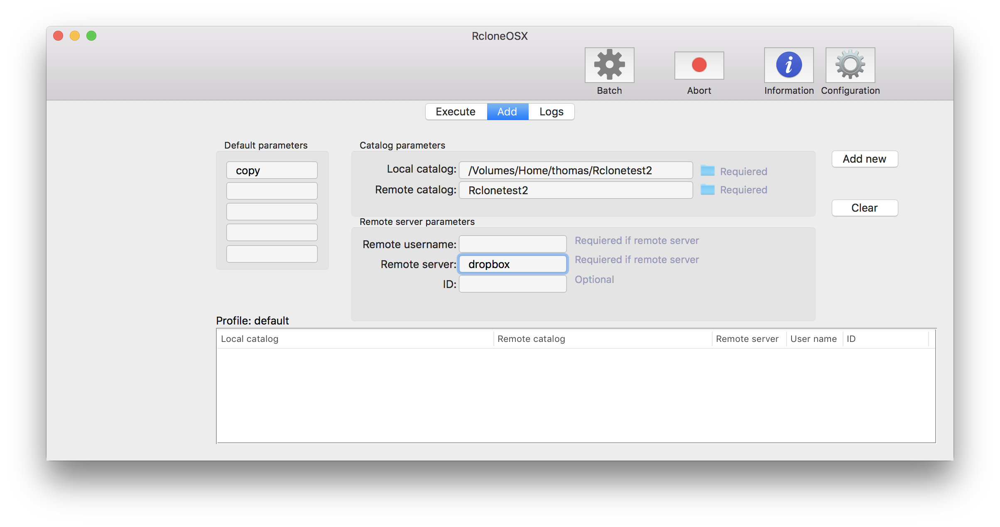
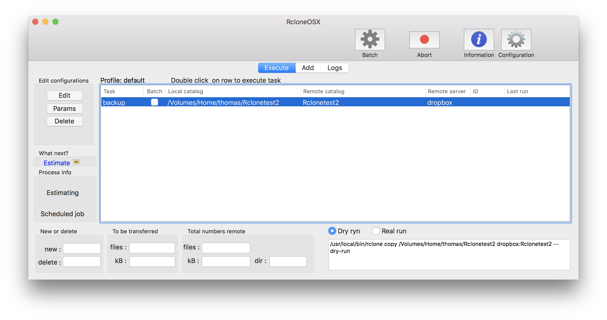
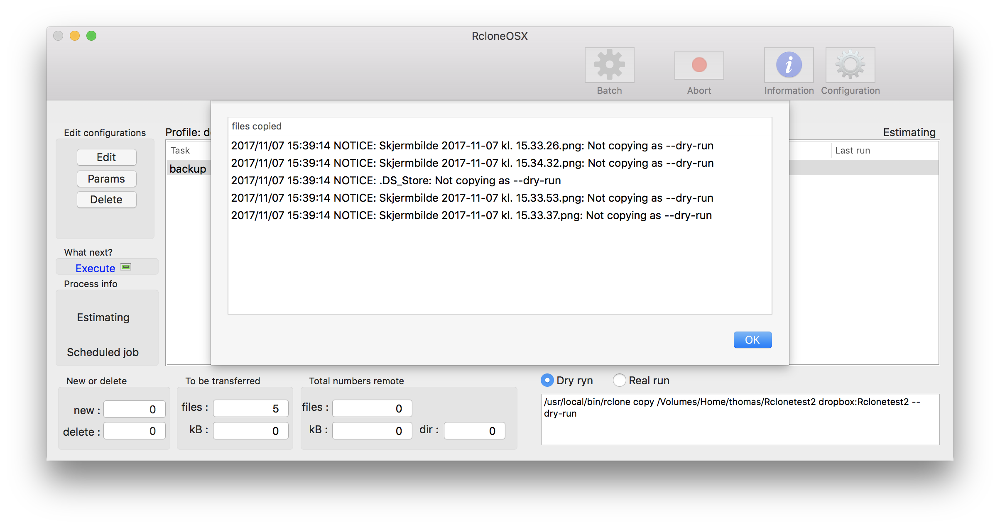
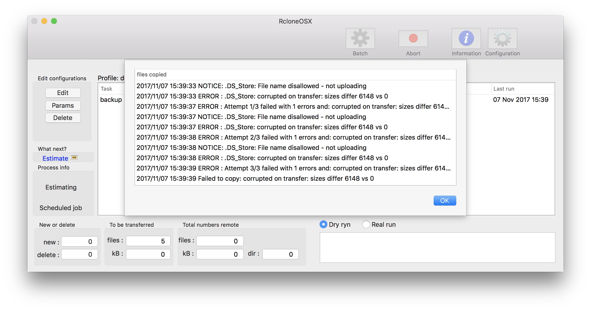
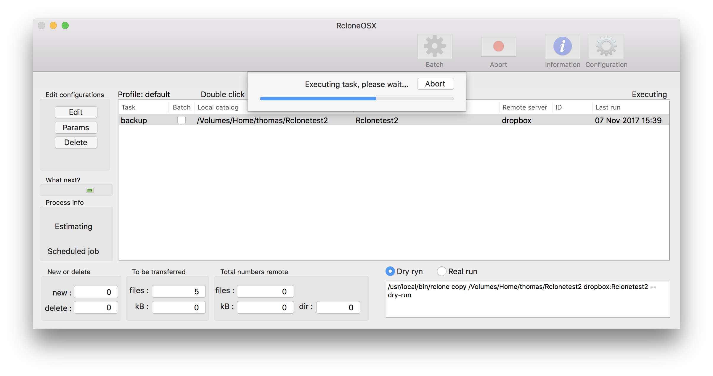
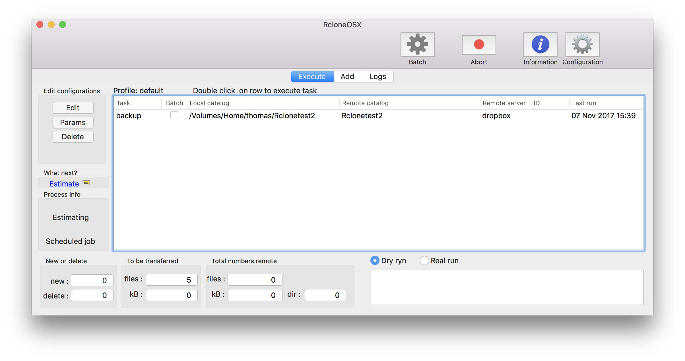
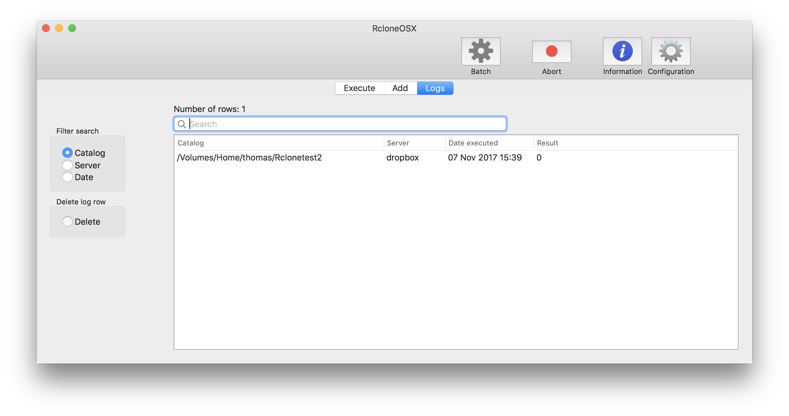
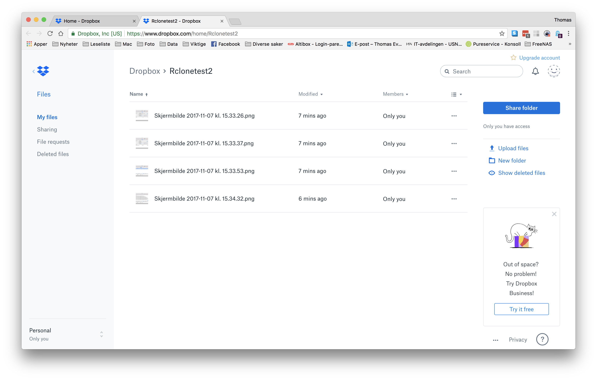

# Changelog

I have commenced a new project adapting RsyncOSX to RcloneOSX. RcloneOSX is (when released in version 1.0.0) utlizing the [rclone](https://rclone.org) command line tool for backup/copy files to various number of cloud storage as dropbox.

## Version 0.0.1

By a couple of hours work with RcloneOSX I managed to do a `rclone copy` of a local directory to remote directory at Dropbox. The Numbers part does not work yet because the output from `rclone` is quite different compared to `rsync`. Below are some screenshots from testing.
Adding a configuration..

Executing a `--dry-run`

Executing the real run. Some files are not copied. The progress bar is working.

Logging the run in main view.

Logging the run, the numbers not yet working.

The transferred files at Dropbox.

